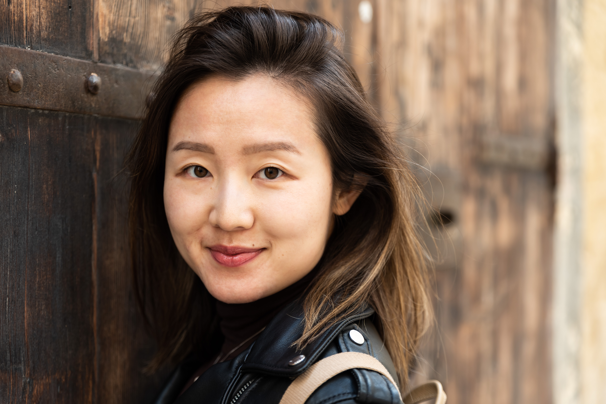

# Personas
## Johnny 

  * 24 year old male in California
  * Freelance software developer
  * BS in computer science
  * Does freelance contract work around every other week. Johnny lives alone, is single, and is trying to branch out and be more sociable, Johnny is colorblind and 
    thus has troubles finding good outfits to match.
## Goals:
  1. Be more confidant in outfits when going out to meet new people
  2. Have a good way of quickly determining what colors work well with each other

## Katherine

  * 29 year old female in New York
  * Highschool Math teacher
  * Masters degree in Math
  * Enjoys teaching but is very self conscious about her appearance and therefore usually sticks to the same 2 or 3 monocolored outfits. She wants to branch out more     and find more interesting outfits to wear but is too nervous to ask for her friends opinions so she just stays wearing the same bland outfits.
## Goals:
  1. Find some software that can make suggestions on her outfits before she wears them out
  2. Get positive feedback when she puts together an outfit

## Mike:

  * 32 Year old lives in Sierra Nevada Foothills
  * Bicycle mechanic
  * AA  Humanities
  * Works part time 3-4 days a week based on workload. Allows opportunities to ride bikes often and often wears biking clothes in all scenarios
## Goals:
  1. Get color styles that are engaging and make a splash while honoring current style trends

## Jenny:

  * 38 Year old lives in Roseville
  * Stay at home mom of 8 & 10 year old / Amazon reviewer
  * BA Marketing
  * Works part time 3-4 hours a day reviewing products while kids are in school. Is a frequent Amazon shopper and has realized perks and benefits to review amazon        products. Being a stay at home mom allows opportunities to spend time with her children 
## Goals:
  1. Jenny is looking to re-enter the job market, she needs an update wardrobe on a budget

# Scenarios
## Johnny: 
Johnny was invited by a previous employer to go to a Anime Convention and he wants to wear something fun but has no idea what he should wear. He has narrowed it down to a few different shirts and shorts but cannot decide on what goes well with what. He often finds himself at an impass at this point and would like a second opinion on how he looks before he decides on his outfit.

## Katherine: 
Katherine wants to wear something that will impress her co-workers at a school/staff casual function. There is an award for best dressed class and she really does not want to let her students down and is looking to really try and put together a nice outfit for the event.

## Mike: 
Mike has a couple events coming up to represent his business in the community. He often wears biking outfits given to him for free or clothes that get greasy working on bikes. For the event he want to draw attention with bold colors but at the same time have good color matching   

## Jenny: 
Jenny is looking at re-entering the job market. She has a minimal budget to work with but wants to look professional and dressed in current color styles for her upcoming interviews. Her husband has a rather plain style and limited exposure to style so there is little support at home when asking for feedback on how she looks.
