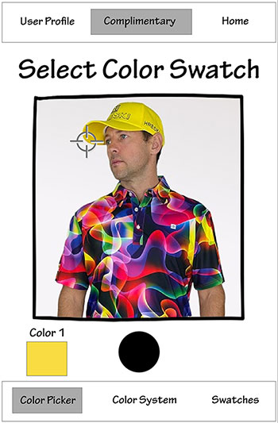
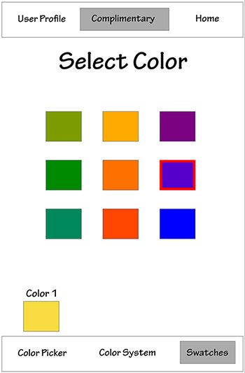

# Phase III: Prototypes and User Testing

**Introduction**

## UX Team Members

* **[Will Simpson](https://usabilityengineering.github.io/ux-portfolio-wjsimpson-chico/)** - UI / UX Designer
* **[Lukas Pecson](https://usabilityengineering.github.io/ux-portfolio-Lpecson/)** - UX Designer

# StyleGuide

StyleGuide offeres quick easy solutions to the age old problem of selecting good colors that work together

# Phase II: Refining interaction and designing wireframes

**Methods**
For our user test we had 5 users try out our prototype using a test that we had created that would have the user go through and utilize each feature we had available in our prototype. Before each test we asked each tester if they had ever used a color picker app before so we could have that additional info on their background as that seemed it would affect how they used our protoype.

Our user test went as follows:

*Step 1*
Task 1 was user needs to find a set of complimentary colors
How we wanted this to be solved was: User should take a picture, select a color in that picture and then using the swatches tab select a complimentary color for the color chosen in the picture.

*Step 2*
Task 2 was user needs to change the color system being used
How we wanted this to be solved was: User navigates to the bottom of the screen and clicks the "Color System" tab and selects one of the options that is not currently selected.(MonoChromatic, Triad, Analogous)

*Step 3*
Task 3 was user wanted to reference a color pairing/grouping that they used in the past
How we wanted this to be solved was: User navigates to the User Profile tab in the top left and then selects a previously matched/grouped set of colors

Once done with all steps of our test we would ask users debreif questions to get some insight on their thoughts on the product including.
"In general, what did you like or dislike the most?"

"Are there any features you felt were needed? Any features to be taken away"

"Are there any other thoughts or comments?"

**Findings**

We got quite a bit of good feedback, that mostly all centered around our naming parts of the prototype, but also that the Home page was a bit unnecessary. 
Most Users found that the home page did not add much as there was nothing but a logo there and additionally didn't have a strong call to action button that would draw the user to the color picker portion which is where you take the photo, and perhaps where our 1st screen should have started. Overall, it seemed that the user being familiar with or used a color picker in the past was not super impactful on their thoughts on our product, as the feedback was very similar to those who had not used a color picker before.

At the core of the application is a "camera" to take a photo of the color needing to get sampled. Once that color was selected, the next step of selecting the complimentary. A few lessons in the this approach were:

#1: Industry Standards of a Camera button did not translate well in actual user cases (Could be a fidelity problem)

#2: The "Select Color" call to action did not draw the user in the right options. "Select color how?" and "Select color from where?" turned out to be the common misunderstanding.

# Color Picker

Another assumed Industry Standard term for selecting colors was the use of "Swatches." As it turns out, none of our test subjects had any familiarity with Pantone color swatches for example. This made for some difficult navigation to get to a complimentary color of a currently selected color.

# Swatches

**Conclusions**

The most obvious conclusion we can draw from our data is that we should have had the names in our prototype be more easily understood, and representative of what that tab was doing. Every single user gave feedback saying that the naming of tabs in our app could have been more representative of their function. An obvious answer was our "Swatches" tab, many of the testers did not know what swatches meant, and those who completed the step mainly did because they had tried all the other tabs already. If we had named it something like "Matches" or "Complimentary colors" the idea would have been better understood more broadly. Additionally, having a very visible call to action button that would take the user to the camera to get them started would also make a lot of sense because our homepage realistically was not very helpful with it just being essentially a page with the app name on it. We were overall very happy with how our testing went and also with how our product was recieved, we got a prototype to the level of functionality that let us run our tests and get good data from it.

**Caveats**

The main and most obvious caveat is that our user testers were all from a UX Design class. So the population we tested is not exactly representative of all end users as each tester has some background in user design. We knew that each tester would have an inheret bias and that we may have gotten different feedback were we to use actual random testers from different backgrounds. However we still believe that the feedback we recieved was very valid and still find the data obtained from our testers to be valueable. Additionally, any of the proposed changes to naming conventions or to our home page of the app would ideally be tested once changed. Then we could have valueable data on if it was easier for the 2nd set of testers than it was originally, and if changing the names really made noticeable imporovement to usability.
