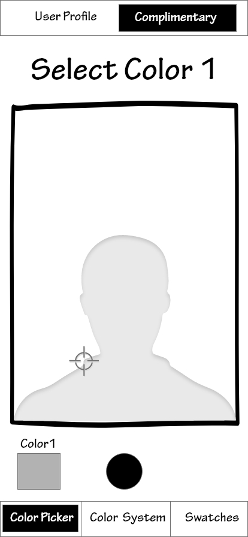
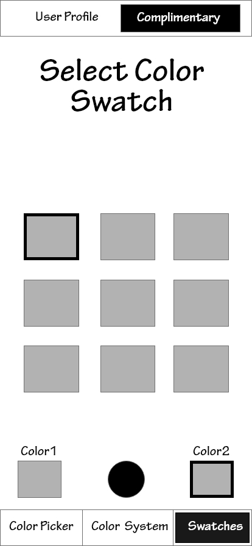
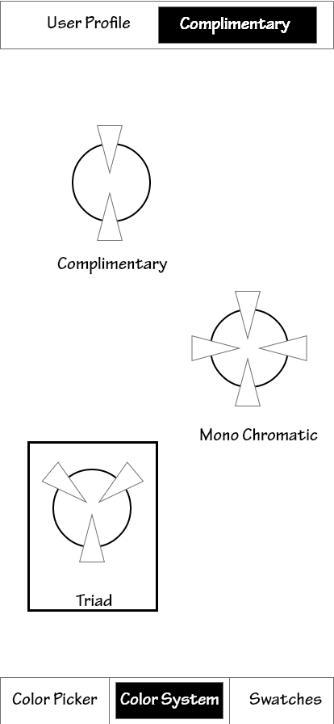
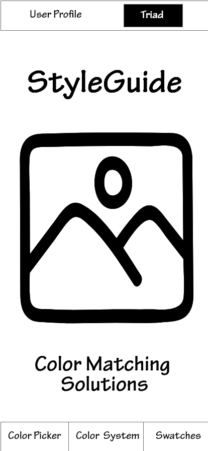
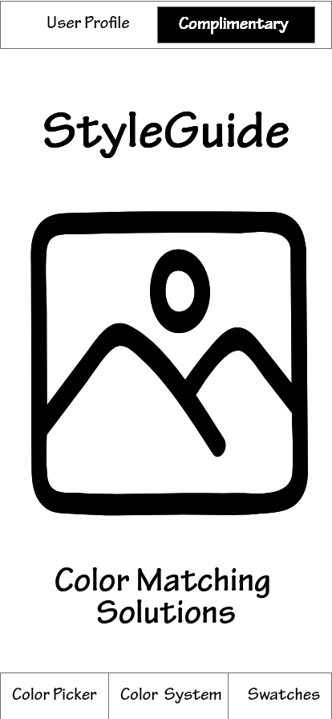
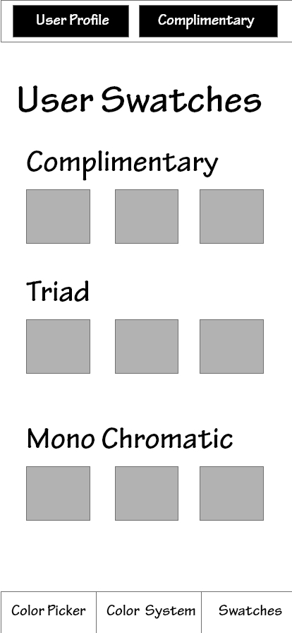

# Wireframes

## Wireframe of Various Scenarios with the StyleGuide application

## Scenario 1 of Selecting a Color Swatch from a photo

<table>
  <tr>
   <td>Start with the Home Page
   </td>
   <td>Take a photo for sampling a specific color
   </td>
  </tr>
  <tr>
   <td>

   </td>
   <td>

   </td>
  </tr>
</table>

## Scenario 1 of Selecting a Color Swatch from a photo

<table>
  <tr>
   <td>Us the color picker to identify a color
   </td>
   <td>Select a swatch in that color range
   </td>
  </tr>
  <tr>
   <td>

   </td>
   <td>

   </td>
  </tr>
</table>

## Scenario 2 - Change the color system

<table>
  <tr>
   <td>Start with the Home Page
   </td>
   <td>Select the color system button
   </td>
  </tr>
  <tr>
   <td>

   </td>
   <td>

   </td>
  </tr>
</table>

## Scenario 2 - Change the color system

<table>
  <tr>
   <td>Select the desired color system
   </td>
   <td>See the updated color system reflected
   </td>
  </tr>
  <tr>
   <td>

   </td>
   <td>

   </td>
  </tr>
</table>

## Scenario 3 - View stored color matches

<table>
  <tr>
   <td>From the home screen select User Profile
   </td>
   <td>Observe the stored color swatches
   </td>
  </tr>
  <tr>
   <td>

   </td>
   <td>

   </td>
  </tr>
</table>
