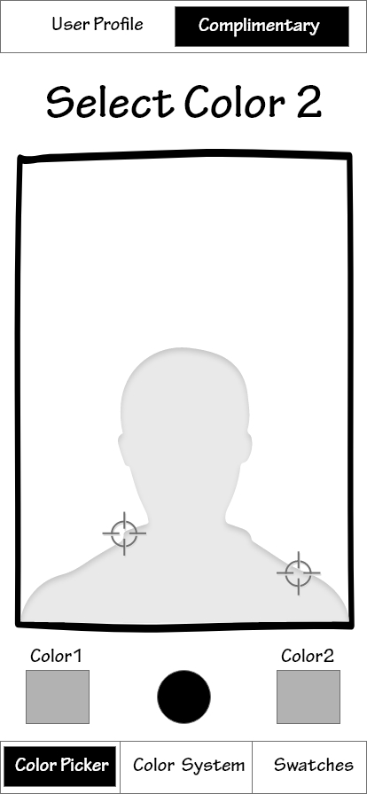

# Wireframes

Wireframe of Various Scenarios with the StyleGuide application

Scenario 1 of Selecting a Color Swatch from a photo

<table>
  <tr>
   <td>
   </td>
   <td>
   </td>
  </tr>
  <tr>
   <td>

   </td>
   <td>

   </td>
  </tr>
</table>

<table>
  <tr>
   <td>
   </td>
   <td>
   </td>
  </tr>
  <tr>
   <td>

   </td>
   <td>

   </td>
  </tr>
</table>

